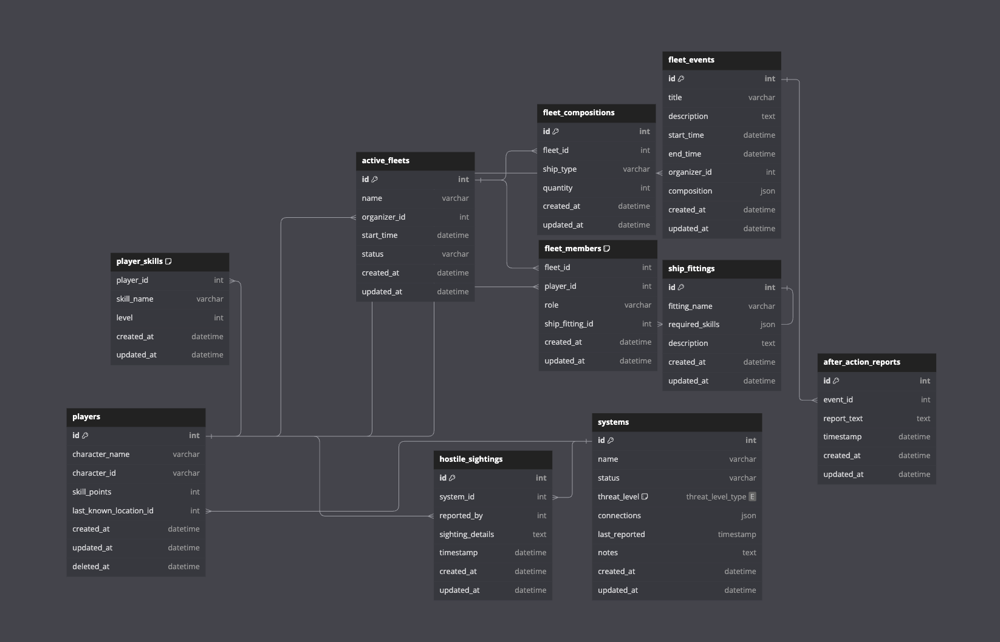

# Pochven Interactive Radar

## Overview

The Pochven Interactive Radar is an advanced tool designed to enhance the strategic gameplay of EVE Online players within the Pochven region. Utilizing real-time data and user-contributed reports, this application provides a dynamic, interactive map that aids Kybernauts in navigating the complex landscape of Pochven. With features designed for fleet commanders, scouts, and players, the radar facilitates informed decision-making through color-guided tags for each system, comprehensive fleet management, and secure login mechanisms.

### Key Features

- **Interactive Map Visualization:** A graphical representation of the Pochven region, allowing users to explore systems with real-time updates.
- **Data Reporting & Input:** Users can input D-Scan reports and attach notes or tags to systems, providing valuable insights for fellow players.
- **Data Retrieval:** Integration with the EVE Swagger Interface (ESI) for live game data, and authentication via EVE's Single Sign-On (SSO) service.
- **User Authentication:** Secure OAuth 2.0 flow for user authentication, ensuring privacy and security for personal information and in-game activities.
- **Responsive Design:** Crafted to provide an optimal experience across various devices, enabling players to stay informed regardless of their platform.

## User Stories

### Key Features

- **Interactive Map Visualization:** Engage with a graphical representation of the Pochven region, featuring clickable systems with real-time updates.
- **Data Reporting & Input:** Submit D-Scan reports, attach notes or tags to systems, and utilize timestamps to ensure up-to-date information.
- **Data Retrieval:** Seamlessly integrate with EVE's Swagger Interface (ESI) for live data pulls and employ SSO for user authentication.
- **User Authentication:** Implement secure OAuth 2.0 authentication processes, safeguarding personal information and in-game activities.
- **Responsive Design:** Ensure an optimal user experience across different devices, making the tool accessible on monitors, tablets, and mobile devices.

## User Stories

### Essential User Stories
- As a player, I want to see an interactive map of Pochven, to understand the region's layout.
- As a fleet commander, I want to see my current location on the map in real-time, for informed navigational decisions.
- As a scout, I want to report hostile sightings, alerting other players of potential dangers.
- As a fleet commander, I want to create and schedule fleet operations, organizing my fleet effectively.
- As a fleet member, I want to view scheduled fleet operations, planning my gameplay sessions around these events.
- As a fleet commander, I want to manage roles and ship fittings of my fleet members, ensuring a balanced and effective fleet composition.
- As a player, I want to log in securely, keeping my personal information and in-game activities private.

### Intermediate User Stories
- As a fleet commander, I want to receive notifications of upcoming scheduled events, preparing in advance.
- As a scout, I want to attach notes and details to my hostile sightings reports, providing comprehensive information to other players.
- As a player, I want to view the history of my movements and actions, analyzing my gameplay to improve.
- As a fleet member, I want to see the fleet's composition in real-time during an operation, adapting to changing tactical situations.
- As a fleet commander, I want to see a list of all active fleets, coordinating with other commanders.

### Advanced User Stories
- As a fleet commander, I want to integrate real-time kill reports, assessing and reacting to losses immediately.
- As a player, I want to compare my skills with ship fitting requirements, training necessary skills for specific fleet roles.
- As a fleet commander, I want to generate after-action reports including detailed metrics and statistics, reviewing the fleet's performance to learn from it.
- As a player, I want to search for specific events, systems, or players, finding information quickly and easily.

### Stretch Goal User Stories
- As a fleet commander, I want to automatically import D-Scan data to analyze fleet compositions, making strategic decisions based on potential threats or targets.
- As a player, I want to access the tool on my mobile device, staying updated when I'm not at my computer.
- As a fleet member, I want to be recommended ship fittings based on my skills and available ships, being most effective in fleet operations.
- As a fleet commander, I want the tool to suggest optimal fleet compositions based on the current meta and my fleet's capabilities, planning successful operations.
- As a developer, I want the application to have an open API, so that other developers can create plugins or additional tools that enhance the functionality of my application.

## Getting Started

1. **Prerequisites:** Familiarize yourself with the EVE Swagger Interface documentation and EVE Online's SSO for user authentication.
2. **Installation:** Instructions will be provided for setting up the Pochven Interactive Radar on your preferred platform.
3. **Usage:** Detailed guides on how to use the interactive map and contribute to the collective intelligence of Kybernauts will be available.

## Contributing

We welcome contributions from the community. Please read our contributing guidelines before submitting pull requests or suggestions to improve the radar.

## License

This project is licensed under the [LICENSE NAME] - see the LICENSE file for details.

## Acknowledgments

- EVE Online and the EVE Swagger Interface (ESI) for providing the data and authentication mechanism that powers this application.
- Our dedicated contributors and the Kybernaut community for their invaluable insights and feedback.


## Getting started
1. Clone this repository (only this branch)

2. Install dependencies

      ```bash
      pipenv install -r requirements.txt
      ```

3. Create a **.env** file based on the example with proper settings for your
   development environment

4. Make sure the SQLite3 database connection URL is in the **.env** file

5. This starter organizes all tables inside the `flask_schema` schema, defined
   by the `SCHEMA` environment variable.  Replace the value for
   `SCHEMA` with a unique name, **making sure you use the snake_case
   convention**.

6. Get into your pipenv, migrate your database, seed your database, and run your Flask app

   ```bash
   pipenv shell
   ```

   ```bash
   flask db upgrade
   ```

   ```bash
   flask seed all
   ```

   ```bash
   flask run
   ```

7. To run the React App in development, checkout the [README](./react-app/README.md) inside the `react-app` directory.


## Deployment through Render.com

First, refer to your Render.com deployment articles for more detailed
instructions about getting started with [Render.com], creating a production
database, and deployment debugging tips.

From the [Dashboard], click on the "New +" button in the navigation bar, and
click on "Web Service" to create the application that will be deployed.

Look for the name of the application you want to deploy, and click the "Connect"
button to the right of the name.

Now, fill out the form to configure the build and start commands, as well as add
the environment variables to properly deploy the application.

### Part A: Configure the Start and Build Commands

Start by giving your application a name.

Leave the root directory field blank. By default, Render will run commands from
the root directory.

Make sure the Environment field is set set to "Python 3", the Region is set to
the location closest to you, and the Branch is set to "main".

Next, add your Build command. This is a script that should include everything
that needs to happen _before_ starting the server.

For your Flask project, enter the following command into the Build field, all in
one line:

```shell
# build command - enter all in one line
npm install --prefix react-app &&
npm run build --prefix react-app &&
pip install -r requirements.txt &&
pip install psycopg2 &&
flask db upgrade &&
flask seed all
```
test2
This script will install dependencies for the frontend, and run the build
command in the __package.json__ file for the frontend, which builds the React
application. Then, it will install the dependencies needed for the Python
backend, and run the migration and seed files.

Now, add your start command in the Start field:

```shell
# start script
gunicorn app:app
```

_If you are using websockets, use the following start command instead for increased performance:_

`gunicorn --worker-class eventlet -w 1 app:app`

### Part B: Add the Environment Variables

Click on the "Advanced" button at the bottom of the form to configure the
environment variables your application needs to access to run properly. In the
development environment, you have been securing these variables in the __.env__
file, which has been removed from source control. In this step, you will need to
input the keys and values for the environment variables you need for production
into the Render GUI.

Click on "Add Environment Variable" to start adding all of the variables you
need for the production environment.

Add the following keys and values in the Render GUI form:

- SECRET_KEY (click "Generate" to generate a secure secret for production)
- FLASK_ENV production
- FLASK_APP app
- SCHEMA (your unique schema name, in snake_case)
- REACT_APP_BASE_URL (use render.com url, located at top of page, similar to
  https://this-application-name.onrender.com)

In a new tab, navigate to your dashboard and click on your Postgres database
instance.

Add the following keys and values:

- DATABASE_URL (copy value from Internal Database URL field)

_Note: Add any other keys and values that may be present in your local __.env__
file. As you work to further develop your project, you may need to add more
environment variables to your local __.env__ file. Make sure you add these
environment variables to the Render GUI as well for the next deployment._

Next, choose "Yes" for the Auto-Deploy field. This will re-deploy your
application every time you push to main.

Now, you are finally ready to deploy! Click "Create Web Service" to deploy your
project. The deployment process will likely take about 10-15 minutes if
everything works as expected. You can monitor the logs to see your build and
start commands being executed, and see any errors in the build process.

When deployment is complete, open your deployed site and check to see if you
successfully deployed your Flask application to Render! You can find the URL for
your site just below the name of the Web Service at the top of the page.

[Render.com]: https://render.com/
[Dashboard]: https://dashboard.render.com/